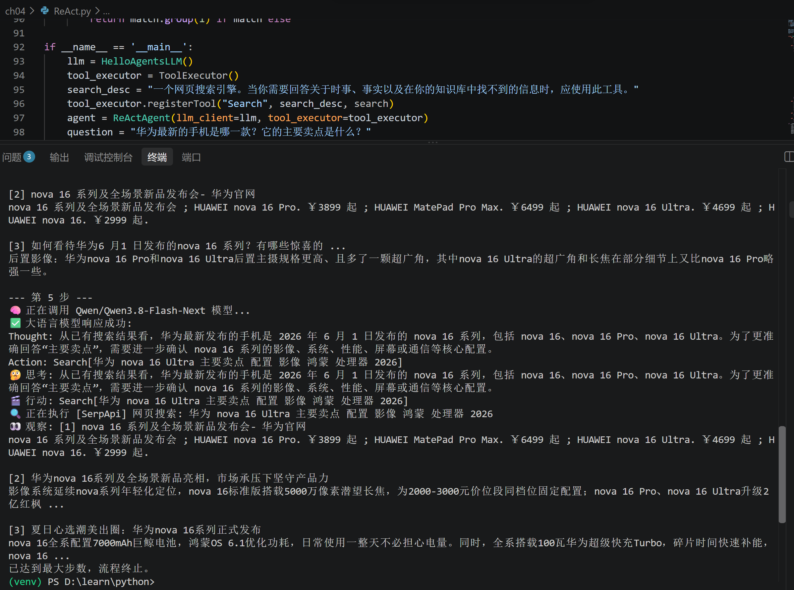
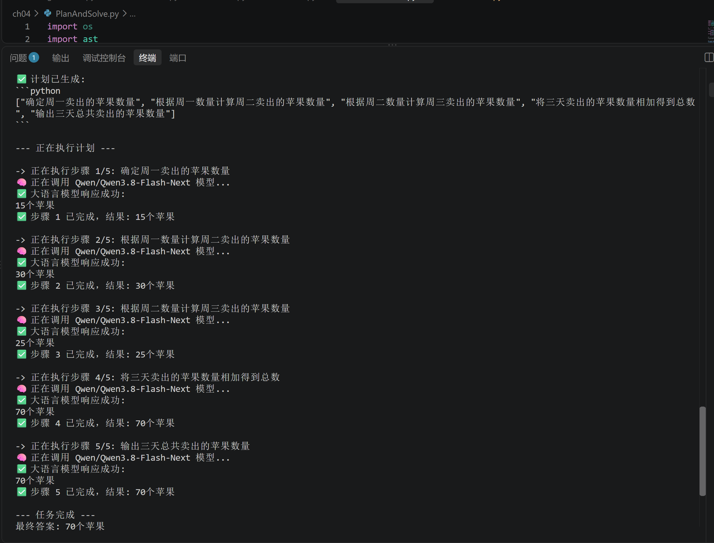
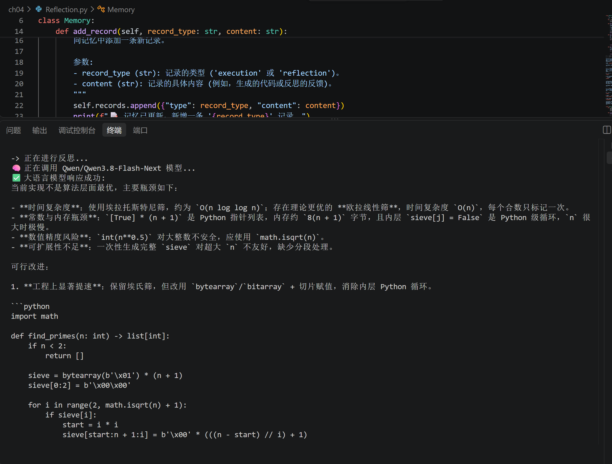

# 《Hello-Agents》第四章“智能体经典范式构建”读书笔记与习题解答

## 一、读书笔记

### 1. 章节核心脉络

第四章是从“理解大语言模型”到“亲手构建智能体”的过渡章节。核心目标是：**从零开始编码实现三种业界经典的智能体构建范式——ReAct、Plan-and-Solve、Reflection**，掌握其提示词设计、输出解析、工具调用与记忆管理等核心工程细节，最终能够根据任务特征选择或组合恰当的范式。

本章强调“重复造轮子”的必要性：直接使用 LangChain 等高度抽象的框架不利于理解底层运行机制，而亲手处理模型输出解析、工具调用失败重试、防止死循环等工程问题，正是培养系统设计能力的最直接方式。掌握设计原理后，当标准组件无法满足复杂需求时，才能拥有深度定制乃至从零构建全新智能体的能力。

### 2. 三种经典范式的核心对比

| 范式               | 组织方式           | 核心特征                   | 一句话类比                 |
| :----------------- | :----------------- | :------------------------- | :------------------------- |
| **ReAct**          | 思考与行动紧密结合 | 边想边做，动态调整         | 侦探现场办案，走一步看一步 |
| **Plan-and-Solve** | 先计划后行动       | 先生成完整计划，再严格执行 | 建筑师先画图纸再施工       |
| **Reflection**     | 自我反思迭代       | 通过自我批判和修正优化结果 | 写完论文自己改稿           |

### 3. ReAct 范式

**核心思想**：在 ReAct 诞生之前，主流方法分为“纯思考”型（如思维链 CoT，推理强但无法与外部世界交互，易产生幻觉）和“纯行动”型（直接输出动作，但缺乏规划和纠错能力）。ReAct 的巧妙之处在于认识到**思考与行动是相辅相成的**——思考指导行动，行动的结果又反过来修正思考。

**核心循环：Thought → Action → Observation**

- **Thought（思考）** ：智能体的“内心独白”，分析当前情况、分解任务、制定下一步计划，或反思上一步的结果
- **Action（行动）** ：决定采取的具体动作，通常是调用一个外部工具
- **Observation（观察）** ：执行 Action 后从外部工具返回的结果

智能体将不断重复这个循环，将新的观察结果追加到历史记录中，形成一个不断增长的上下文，直到在 Thought 中认为已经找到最终答案。

**循环终止策略**：工程化硬截断，包括显式终结动作（预设 `Finish` 指令）、最大迭代上限（通常 5-15 轮）、结果同质化检测、资源耗尽强制返回。

**输出解析**：使用正则表达式解析 LLM 输出的 Thought 和 Action，简单直接但存在脆弱性——模型输出格式偏差可能导致解析失败。


### 4. Plan-and-Solve 范式

**核心思想**：解决思维链在处理多步骤复杂问题时容易“偏离轨道”的问题。与 ReAct 将思考和行动融合在每一步不同，Plan-and-Solve 将流程解耦为两个核心阶段。

**两阶段工作流**：

- **规划阶段**：接收完整问题，不直接解决或调用工具，而是将问题分解，制定清晰、分步骤的行动计划
- **执行阶段**：获得完整计划后，严格按照计划中的步骤逐一执行

**适用场景**：逻辑路径确定、结构性强、可被清晰分解的复杂任务。


### 5. Reflection 范式

**核心思想**：灵感来源于人类的学习过程，核心工作流程为**执行 → 反思 → 优化**三步循环。

- **执行**：使用 ReAct 或 Plan-and-Solve 等方法尝试完成任务，生成初步方案
- **反思**：调用独立的 LLM 实例扮演“评审员”，对初步方案进行自我批判
- **优化**：基于反思提出的批评和建议，修正和优化方案

**范式组合**：Reflection 通常作为**增强层**叠加在其他范式之上，先用 ReAct 或 Plan-and-Solve 出方案，再用 Reflection 审查优化。


### 6. 工程实现要点

- **环境准备**：Python 3.10+，`openai` 库，`python-dotenv` 库
- **LLM 客户端封装**：定义 `HelloAgentsLLM` 类，封装所有与模型服务交互的细节，支持任何兼容 OpenAI 接口的服务
- **工具定义**：以“名称-描述-函数”的形式注册，智能体通过工具描述选择合适的工具并构造调用参数

## 二、课后习题与解答

### 习题 1：三种范式的本质区别与组合设计

**题目**：本章介绍了三种经典智能体范式：ReAct、Plan-and-Solve 和 Reflection。请分析：

**1.1 这三种范式在“思考”与“行动”的组织方式上有什么本质区别？**

- **ReAct**：采用**边思考边行动**的组织方式，实时性强，适应动态环境，但规划能力弱，依赖及时反馈，可能陷入局部最优
- **Plan-and-Solve**：采用**先思考后行动**的组织方式，先做整体规划再执行，保证目标一致性，但灵活性不足，适合复杂任务分解
- **Reflection**：采用**先行动后思考**的组织方式，在执行后引入反思和内部纠错机制，优化最终结果

**1.2 设计“智能家居控制助手”，选择哪种范式？为什么？**

有两种可行的思路：

**思路一：选择 Plan-and-Solve**——先分析用户行为习惯，做出整体规划后再执行。智能家居控制逻辑路径清晰，适合先规划后执行的范式。

**思路二：选择 ReAct**——用户下达指令后希望快速响应，对实时性要求较高；家居设备控制是序列决策过程，需要根据环境变化动态调整。

**综合建议**：以 **ReAct 为基础架构**，因为智能家居场景需要即时响应和动态调整；同时可叠加 **Reflection** 层，定期根据用户反馈优化自动化策略。

**1.3 是否可以将三种范式组合使用？设计混合范式架构并说明适用场景。**

可以组合使用。一种典型的混合架构是：

1. **Plan-and-Solve 进行任务分解**：获得多个子任务
2. **ReAct 执行每个子任务**：边思考边行动，调用相应工具
3. **Reflection 进行反思纠错**：对每个子任务的结果进行审查和优化

**适用场景**：任务较为复杂、需要多步完成，但每个步骤都存在一定不确定性的场景。例如旅游规划——需要用户喜好收集、城市确定、地点确定、整体游览顺序、交通工具购票、可行性判定等多个步骤，任务流程复杂但有一定步骤顺序，同时存在出错需要反思的地方。

### 习题 2：ReAct 输出解析的脆弱性与改进方案

**题目**：在 4.2 节的 ReAct 实现中，我们使用了正则表达式来解析大语言模型的输出（如 Thought 和 Action）。请思考：

**2.1 当前的解析方法存在哪些潜在的脆弱性？**

- 模型输出可能不严格按照要求输出，可能存在大小写、时态、中英文混用等格式偏差
- 即使模型给出了正确的答案，但由于无法正确解析，仍然会导致任务失败

**2.2 有哪些更鲁棒的输出解析方案？**

- **提示词中要求 LLM 按固定 JSON 格式输出**：明确约束输出结构
- **微调大模型**：使之能够稳定输出结构化内容
- **使用轻量大模型提取 Action**：用小模型专门做格式解析

**2.3 修改代码使用更可靠的输出格式，并对比优缺点**

改用 JSON 格式的示例：

```json
{
  "thought": "需要查询天气",
  "action": "call_weather",
  "parameters": {"city": "北京"}
}
```


**对比**：

| 维度         | 正则表达式         | JSON 格式               |
| :----------- | :----------------- | :---------------------- |
| **实现难度** | 低，直接匹配文本   | 中，需模型稳定输出 JSON |
| **鲁棒性**   | 低，格式偏差即失败 | 高，结构化解析容错性强  |
| **可读性**   | 需自行设计正则     | 结构清晰，易于调试      |
| **依赖**     | 无额外依赖         | 需 JSON 解析器          |

### 习题 3：工具扩展实践——添加计算器工具

**题目**：为 ReAct 智能体添加一个“计算器”工具，使其能够处理复杂的数学计算问题。

```python
def calculator_tool(query: str) -> str:
    """
    安全计算器工具，支持基本数学运算。
    query: 数学表达式字符串，如 "(123 + 456) * 789 / 12"
    """
    import re

    # 安全校验：只允许数字、运算符、括号和小数点
    if not re.match(r'^[\d\s+\-*/().]+$', query):
        return "错误：表达式包含非法字符"

    try:
        # 限制内置函数访问，防止恶意代码执行
        allowed_names = {"__builtins__": {}}
        result = eval(query, allowed_names)
        return f"计算结果：{result}"
    except ZeroDivisionError:
        return "错误：除数不能为零"
    except Exception as e:
        return f"计算错误：{str(e)}"

# 注册工具
tools = {
    "calculator": {
        "name": "calculator",
        "description": "执行数学计算，输入数学表达式字符串",
        "function": calculator_tool
    }
}
```


**工具调用失败处理**：在 ToolExecutor 中增加重试机制和降级策略——若工具调用失败，返回错误信息给 LLM，由 LLM 决定下一步（重试、换工具或终止）。

**海量工具优化**：当工具数量很多时，可采用：

- **工具向量索引**：用 Embedding 存储工具描述，LLM 生成任务向量，检索 Top-5 最相关工具展示在提示词中
- **工具推荐**：基于历史任务类型推荐常用工具
- **分层提示**：先让 LLM 判断任务类型，再展示对应类别的工具，避免信息过载

### 习题 4：Plan-and-Solve 的动态重规划机制

**题目**：在 4.3 节的实现中，规划阶段生成的计划是“静态”的。如果在执行过程中发现某个步骤无法完成或结果不符合预期，应该如何设计“动态重规划”机制？

**动态重规划机制设计**：

核心思想：执行每一步后，检查结果是否符合预期，若不符合则触发重规划，基于当前状态调整后续步骤。

实现逻辑：

```python
def execute(self, question: str, plan: list[str]) -> str:
    history = ""
    i = 0
    while i < len(plan):
        step = plan[i]
        prompt = EXECUTOR_PROMPT_TEMPLATE.format(
            question=question, plan=plan,
            history=history, current_step=step
        )
        response_text = self.llm_client.think(messages=messages) or ""

        # 检查步骤是否失败
        if self._is_step_failed(response_text):
            print(f"❌ 步骤 {i+1} 执行失败，触发重规划")
            replan_prompt = f"""
            原始问题：{question}
            原计划：{plan}
            已完成步骤：{history}
            失败步骤：{step}，失败原因：{response_text}
            请基于当前状态，生成调整后的后续计划（仅输出步骤列表）
            """
            new_plan = self.llm_client.think(
                [{"role": "user", "content": replan_prompt}]
            )
            plan = plan[:i] + self._parse_plan(new_plan)
            print(f"✅ 重规划后的计划：{plan}")
            continue  # 不递增 i，重新执行调整后的当前步骤

        history += f"步骤 {i+1}: {step}\n结果: {response_text}\n\n"
        i += 1

    return history

def _is_step_failed(self, response_text: str) -> bool:
    fail_keywords = ["错误", "无法完成", "不存在", "失败"]
    return any(kw in response_text for kw in fail_keywords)
```


**Plan-and-Solve 与 ReAct 的适用性对比（以商务旅行预订为例）** ：

建议 **Plan-and-Solve 为主，ReAct 为辅**：

- 商务旅行预订是结构化任务（机票→酒店→租车），步骤明确，Plan-and-Solve 可生成固定计划提升效率
- 存在不确定性（如机票售罄、酒店满房），需 ReAct 动态调整（更换航班、选择备选酒店）
- **实现逻辑**：规划阶段生成“查询航班→预订机票→查询酒店→预订酒店→预订租车”的计划；执行阶段若某步骤失败，触发 ReAct 逻辑调用搜索工具查找备选方案，调整后续步骤

**分层规划系统设计**：

- **高层规划**：将任务分解为“目标级”步骤，如“商务旅行预订”→[“交通安排”、“住宿安排”、“出行安排”]
- **低层规划**：针对每个高层步骤再生成详细的子计划

**优势**：降低单次规划的复杂度，避免因一个步骤变化导致全局重规划，提高系统的可维护性和可扩展性。

### 习题 5：Reflection 的模型分工与终止条件优化

**题目**：Reflection 机制通过“执行-反思-优化”循环来提升输出质量。请思考：

**5.1 执行、反思、优化三个角色是否应该由同一个模型实例承担？为什么？**

**不应该**。理由：

- **执行**需要模型具备较强的任务完成能力，关注准确性和效率
- **反思**需要模型具备批判性思维，能够发现方案中的问题和不足
- **优化**需要模型具备改进能力，基于反思意见生成更好的方案

使用**不同模型实例**（或同一模型的不同提示词角色）可以让每个阶段聚焦于自身目标，避免角色混淆。执行模型不需要“自我批判”的能力，反思模型也不需要“完成任务”的压力，分工明确才能各司其职-。

**5.2 终止条件如何设计？**

Reflection 循环的终止条件可以采用：

- **质量阈值**：当反思阶段未发现新的问题（或问题数量低于阈值）时终止
- **迭代次数上限**：设置最大迭代轮数（如 3 轮），防止无限循环
- **分数收敛**：若连续两轮优化的改进幅度低于阈值，判定已收敛
- **资源耗尽**：Token 预算或时间预算耗尽时强制终止

**5.3 反思阶段发现的问题可能存在“假阳性”（实际不存在的问题），如何处理？**

- **多轮投票**：让多个反思实例独立审查，取多数一致的问题作为有效问题
- **置信度过滤**：要求反思模型为每个问题标注置信度，低置信度问题不纳入优化
- **交叉验证**：对反思提出的问题，调用执行模型进行验证，确认问题是否真实存在
- **人工审核**：在关键任务中，将高置信度问题提交人工审核后再进入优化阶段

## 三、个人思考

第四章的核心价值在于**将智能体的抽象概念落地为可运行的代码**。最深刻的启示是：三种范式并非互斥，而是**从不同维度组织“思考-行动”循环的控制策略**。ReAct 解决“如何在行动中动态调整”，Plan-and-Solve 解决“如何避免复杂任务中的路径偏离”，Reflection 解决“如何让智能体自我改进”。在真实系统中，三者往往以流水线方式串联——用 Plan-and-Solve 出方案，用 ReAct 执行，用 Reflection 审查。理解每种范式的**适用场景与工程代价**（延迟、Token 消耗、解析复杂度），是做出合理架构决策的关键。
